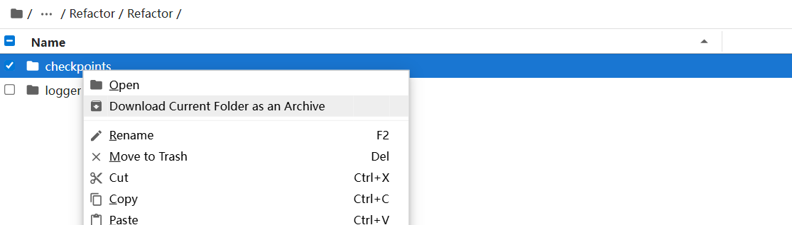
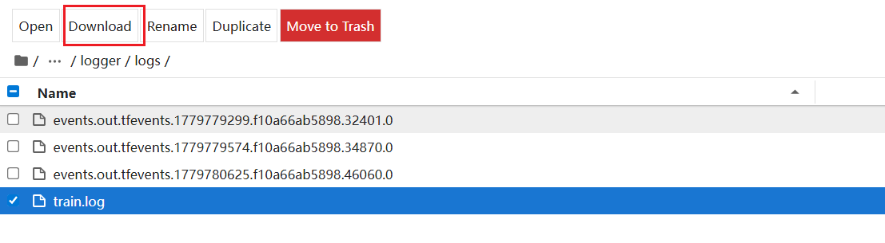

0、连接服务器

不能直接复制进去，这样连接的时候会报错

```
ssh -p 63892 root@171.252.39.127 -L 8080:localhost:8080
```

要这么搞，感觉没区别啊

```
Host vastai-gpu
    HostName 171.252.39.127
    User root
    Port 63892
    LocalForward 8080 localhost:8080
```


**1、创建环境**

```
conda create -n sg_llie python=3.10
conda activate sg_llie

conda install pytorch torchvision torchaudio pytorch-cuda=11.8 -c pytorch -c nvidia
pip install opencv-python numpy pyyaml tqdm einops tensorboard lpips gdown
```

cuda不见了：命令是要安装cuda版的torch，但是显示安装cpu版的torch，貌似是因为服务器的配置原因

```
nvidia-smi
# 卸载torch
python -m pip uninstall -y torch torchvision torchaudio
# 检测cuda
python -c "import torch; print(torch.__version__); print(torch.version.cuda); print(torch.cuda.is_available()); print(torch.cuda.device_count())"

# 安装GPU版torch
python -m pip install torch torchvision torchaudio --index-url https://download.pytorch.org/whl/cu118
```

2、下载代码

```
git clone https://github.com/jaxhur/SG_LLIE.git
git switch codex-sg-llie-refactor
```

**3、准备数据集**

现在本地处理好数据，上传到谷歌网盘，再下载

```
https://drive.google.com/file/d/1qPU5gh5l9taDrtWQIMZ5Bp636GBuHk-y/view?usp=drive_link

gdown "https://drive.google.com/uc?id=1qPU5gh5l9taDrtWQIMZ5Bp636GBuHk-y"

mv LOL-v1.zip ./SG_LLIE/Refactor/data

unzip LOL-v1.zip -d LOL-v1

# 删除文件夹
rm -rf our485 val5 eval15
```

使用LOLv1：

```
data/LOL-v1/
  our485/
    low/
    high/
  eval15/
    low/
    high/
```

从训练集中选择5个图片作为验证集val5

```
data/LOL-v1/
  our485/
    low/
    high/
  eval15/
    low/
    high/
  val5/
    low/
    high/
```

事先计算低光图片的结构先验

```shell
python Refactor\utils\prior.py --input_dir Refactor\data\LOL-v1\our485\low --output_dir Refactor\data\LOL-v1\our485\low_s
#python Refactor\utils\prior.py --input_dir Refactor\data\LOL-v1\our485\high --output_dir Refactor\data\LOL-v1\our485\high_s
python Refactor\utils\prior.py --input_dir Refactor\data\LOL-v1\eval15\low --output_dir Refactor\data\LOL-v1\eval15\low_s
#python Refactor\utils\prior.py --input_dir Refactor\data\LOL-v1\eval15\high --output_dir Refactor\data\LOL-v1\eval15\high_s
python Refactor\utils\prior.py --input_dir Refactor\data\LOL-v1\val5\low --output_dir Refactor\data\LOL-v1\val5\low_s
#python Refactor\utils\prior.py --input_dir Refactor\data\LOL-v1\val5\high --output_dir Refactor\data\LOL-v1\val5\high_s
```

```
data/LOL-v1/
  our485/
    low/
    high/
    low_s/
    high_s/
  eval15/
    low/
    high/
    low_s/
    high_s/
  val15/
    low/
    high/
    low_s/
    high_s/
```

训练：

```
cd ./Refactor
PYTHONPATH=. python -m train.train \
  --config configs/sg_llie_ntire25.yaml \
  --train_lq_dir data/LOL-v1/our485/low \
  --train_gt_dir data/LOL-v1/our485/high \
  --train_lq_s_dir data/LOL-v1/our485/low_s \
  --val_lq_dir data/LOL-v1/eval15/low \
  --val_gt_dir data/LOL-v1/eval15/high \
  --val_lq_s_dir data/LOL-v1/eval15/low_s
  
```

> 问题：随机旋转拼接后，导致一个batch中尺度不一样，则只能进行随机截取，因此要增强就不能整个图片进行训练或者batch_size只能为1

从 PyTorch 2.6 开始，torch.load() 默认变成了`weights_only=True`。训练保存的 checkpoint 不是单纯的权重，它里面还有 optimizer / scheduler / iteration / best_metric 等信息，其中包含了 numpy 类型，所以 PyTorch 默认安全加载失败了

测试的Refactor/utils/checkpoint.py需要加上``weights_only=False`

```
checkpoint = torch.load(path, map_location=device, weights_only=False)
```

测试

```
python test/test.py \
  --config configs/sg_llie_ntire25.yaml \
  --input_dir data/LOL-v1/eval15/low \
  --input_s_dir data/LOL-v1/eval15/low_s \
  --gt_dir data/LOL-v1/eval15/high \
  --weights Refactor/checkpoints/best_psnr.pth \
  --result_dir Refactor/test/results
```


# 数据增强方式

- [ ] 对于低光增强任务，使用裁剪是否合适，毕竟可能需要使用全局信息，只裁剪局部理论上不太行吧
- [ ] 现在还有个问题就是如果不使用随机裁切，只采取随机反转的话，可能导致对于同一个batch中图片的hw不同，比如原始图像都是宽600x高400，旋转后可能导致一个batch中的图片宽高不同；有什么解决方案，比如对于同一个batch使用相同的随机数据增强策略？
- [ ] 你给我改一下，增加单独的开关，比如训练时是否随机裁剪、是否开启随机几何增强


# 训练

## 训练中间结果

3060训练的好慢啊，总共花了6

/workspace/SG_LLIE/Refactor/Refactor/logger/logs/events.out.tfevents.1779779299.f10a66ab5898.32401.0是**TensorBoard 日志文件**

```
tensorboard --logdir Refactor/logger/logs

# 关闭生成
use_tb_logger: false
```


训练结果不太好啊，测试集50000轮了，还是PSNR 20.9709 SSIM 0.8242，而且到后面由于学习率下降了，几乎没变化

```
2026-05-26 11:51:59 INFO: iter: 50020/60000 lr: 0.00002795 loss: 0.054240 charbonnier: 0.045823 perceptual: 0.010598 msssim: 0.020778
2026-05-26 11:52:05 INFO: iter: 50040/60000 lr: 0.00002784 loss: 0.050158 charbonnier: 0.043417 perceptual: 0.011030 msssim: 0.016577
2026-05-26 11:52:11 INFO: iter: 50060/60000 lr: 0.00002774 loss: 0.039904 charbonnier: 0.034434 perceptual: 0.009398 msssim: 0.013438
2026-05-26 11:52:17 INFO: iter: 50080/60000 lr: 0.00002764 loss: 0.063465 charbonnier: 0.054348 perceptual: 0.014389 msssim: 0.022434
2026-05-26 11:52:23 INFO: iter: 50100/60000 lr: 0.00002754 loss: 0.051285 charbonnier: 0.043229 perceptual: 0.010805 msssim: 0.019871
2026-05-26 11:52:29 INFO: iter: 50120/60000 lr: 0.00002743 loss: 0.054728 charbonnier: 0.048234 perceptual: 0.012702 msssim: 0.015919
2026-05-26 11:52:35 INFO: iter: 50140/60000 lr: 0.00002733 loss: 0.054468 charbonnier: 0.048945 perceptual: 0.013527 msssim: 0.013470
```


# 下载数据

vastai直接在vscode或者finalshell中下载很慢，只有32kB，要在他提供的jupyter里面下载，速度还行，差不多有1MB

但是checkpoints，不知道为什么，貌似是因为存了不少checkpoints，太大了，根本打不开，只能直接作为zip整个下载

在vscode里面删除文件太慢了，使用finalshell中的快速删除(rm指令)很快





# 测试

测试结果也不太行


训练一下原代码看看
